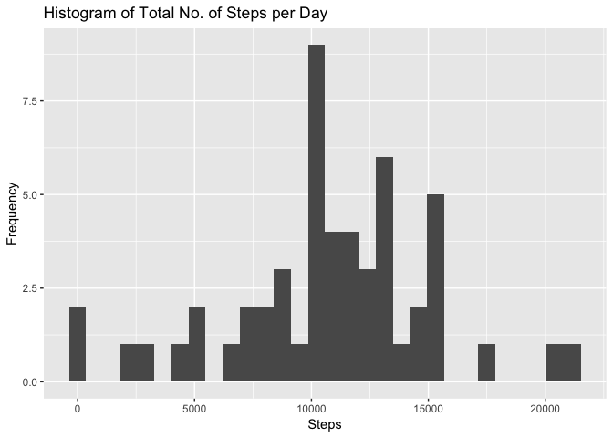
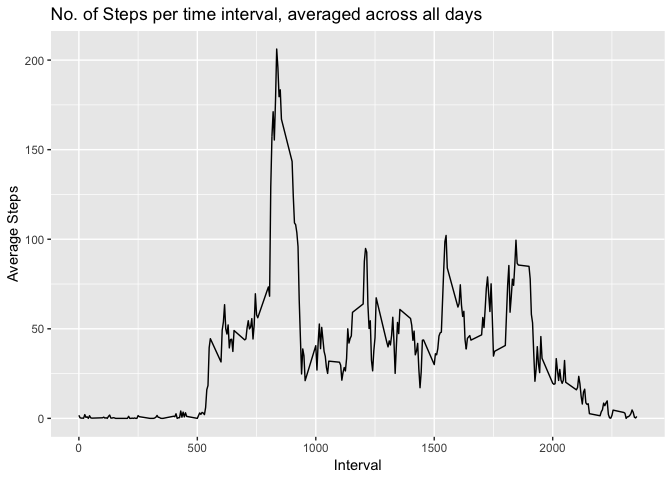
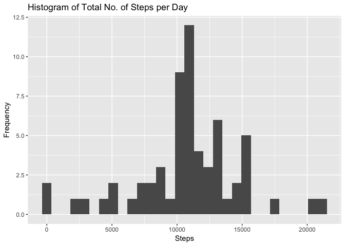
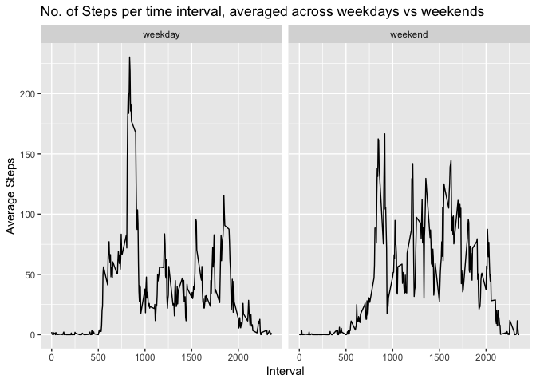

#Introduction

It is now possible to collect a large amount of data about personal movement using activity monitoring devices such as a Fitbit, Nike Fuelband, or Jawbone Up. These type of devices are part of the “quantified self” movement – a group of enthusiasts who take measurements about themselves regularly to improve their health, to find patterns in their behavior, or because they are tech geeks. But these data remain under-utilized both because the raw data are hard to obtain and there is a lack of statistical methods and software for processing and interpreting the data.  

This assignment makes use of data from a personal activity monitoring device. This device collects data at 5 minute intervals through out the day. The data consists of two months of data from an anonymous individual collected during the months of October and November, 2012 and include the number of steps taken in 5 minute intervals each day. The variables included in this dataset are:  

**steps**: Number of steps taking in a 5-minute interval (missing values are coded as NA)  
**date**: The date on which the measurement was taken in YYYY-MM-DD format  
**interval**: Identifier for the 5-minute interval in which measurement was taken

*The dataset is stored in a comma-separated-value (CSV) file and there are a total of 17,568 observations in this dataset.*

#Data Analysis

## Loading and preprocessing the data

Show any code that is needed to

1. Load the data (i.e. read.csv())
2. Process/transform the data (if necessary) into a format suitable for your analysis


```r
rm(list=ls())
library(lubridate); library(dplyr); library(ggplot2)
activitylog=tbl_df(read.csv('activity.csv',header=T,stringsAsFactors=F)) %>%
  mutate(date=ymd(date))
activitylog
```

```
## # A tibble: 17,568 x 3
##    steps date       interval
##    <int> <date>        <int>
##  1    NA 2012-10-01        0
##  2    NA 2012-10-01        5
##  3    NA 2012-10-01       10
##  4    NA 2012-10-01       15
##  5    NA 2012-10-01       20
##  6    NA 2012-10-01       25
##  7    NA 2012-10-01       30
##  8    NA 2012-10-01       35
##  9    NA 2012-10-01       40
## 10    NA 2012-10-01       45
## # ... with 17,558 more rows
```

## What is mean total number of steps taken per day?

*For this part of the assignment, you can ignore the missing values in the dataset.*

1. Calculate the total number of steps taken per day
2. Make a histogram of the total number of steps taken each day
3. Calculate and report the mean and median of the total number of steps taken per day


```r
activity_day<- activitylog %>%
  group_by(date) %>%
  summarize(total=sum(steps))
g<-ggplot(activity_day,aes(total))
g+geom_histogram()+labs(title='Histogram of Total No. of Steps per Day',x='Steps',y='Frequency')
```

<!-- -->

```r
summary(activity_day$total)
```

```
##    Min. 1st Qu.  Median    Mean 3rd Qu.    Max.    NA's 
##      41    8841   10760   10770   13290   21190       8
```

## What is the average daily activity pattern?

1. Make a time series plot (i.e. type="l") of the 5-minute interval (x-axis) and the average number of steps taken, averaged across all days (y-axis)
2. Which 5-minute interval, on average across all the days in the dataset, contains the maximum number of steps?


```r
activity_interval<- activitylog %>%
  group_by(interval) %>%
  summarize(intervalmean=mean(steps,na.rm=T))
g<-ggplot(activity_interval,aes(interval,intervalmean))
g+geom_line()+labs(title='No. of Steps per time interval, averaged across all days',x='Interval',y='Average Steps')
```

<!-- -->

```r
maxint<-with(data=activity_interval,interval[which.max(intervalmean)])
```
**The 5-minute interval that contains the most number of steps is 835.**

## Imputing missing values

*Note that there are a number of days/intervals where there are missing values (coded as NA). The presence of missing days may introduce bias into some calculations or summaries of the data.*

1. Calculate and report the total number of missing values in the dataset (i.e. the total number of rows with NAs)
2. Devise a strategy for filling in all of the missing values in the dataset. The strategy does not need to be sophisticated. For example, you could use the mean/median for that day, or the mean for that 5-minute interval, etc.
3. Create a new dataset that is equal to the original dataset but with the missing data filled in
4. Make a histogram of the total number of steps taken each day and Calculate and report the mean and median total number of steps taken per day. Do these values differ from the estimates from the first part of the assignment? What is the impact of imputing missing data on the estimates of the total daily number of steps?


```r
miss<-sum(is.na(activitylog$steps))
```
**There are 2304 missing values in the dataset.**

```r
activitylog_modified<- tbl_df(merge(activitylog,activity_interval,by='interval')) %>%
  arrange(date,interval) %>%
  mutate(steps=ifelse(is.na(steps),intervalmean,steps)) %>%
  select(steps,date,interval)
activitylog_modified
```

```
## # A tibble: 17,568 x 3
##     steps date       interval
##     <dbl> <date>        <int>
##  1 1.72   2012-10-01        0
##  2 0.340  2012-10-01        5
##  3 0.132  2012-10-01       10
##  4 0.151  2012-10-01       15
##  5 0.0755 2012-10-01       20
##  6 2.09   2012-10-01       25
##  7 0.528  2012-10-01       30
##  8 0.868  2012-10-01       35
##  9 0      2012-10-01       40
## 10 1.47   2012-10-01       45
## # ... with 17,558 more rows
```

```r
activity_day_modified<- activitylog_modified %>%
  group_by(date) %>%
  summarize(total=sum(steps))
g<-ggplot(activity_day_modified,aes(total))
g+geom_histogram()+labs(title='Histogram of Total No. of Steps per Day',x='Steps',y='Frequency')
```

<!-- -->

```r
summary(activity_day_modified$total)
```

```
##    Min. 1st Qu.  Median    Mean 3rd Qu.    Max. 
##      41    9819   10770   10770   12810   21190
```
**Imputing the missing data increased the median of the total daily number of steps. Mean remains unchanged.**

## Are there differences in activity patterns between weekdays and weekends?

*For this part the weekdays() function may be of some help here. Use the dataset with the filled-in missing values for this part.*

1. Create a new factor variable in the dataset with two levels – “weekday” and “weekend” indicating whether a given date is a weekday or weekend day.
2. Make a panel plot containing a time series plot (i.e. type="l") of the 5-minute interval (x-axis) and the average number of steps taken, averaged across all weekday days or weekend days (y-axis).


```r
activity_week_modified<- activitylog_modified %>%
  mutate(ind=lubridate::wday(date,label=F,week_start=getOption("lubridate.week.start", 1))) %>%
  mutate(ind=as.factor(ifelse(ind<=5,'weekday','weekend')))
activity_week_modified
```

```
## # A tibble: 17,568 x 4
##     steps date       interval ind    
##     <dbl> <date>        <int> <fct>  
##  1 1.72   2012-10-01        0 weekday
##  2 0.340  2012-10-01        5 weekday
##  3 0.132  2012-10-01       10 weekday
##  4 0.151  2012-10-01       15 weekday
##  5 0.0755 2012-10-01       20 weekday
##  6 2.09   2012-10-01       25 weekday
##  7 0.528  2012-10-01       30 weekday
##  8 0.868  2012-10-01       35 weekday
##  9 0      2012-10-01       40 weekday
## 10 1.47   2012-10-01       45 weekday
## # ... with 17,558 more rows
```

```r
activity_interval_modified<- activity_week_modified %>%
  group_by(ind,interval) %>%
  summarize(intervalmean=mean(steps))
g<-ggplot(activity_interval_modified,aes(interval,intervalmean))
g+geom_line()+facet_grid(.~ind)+labs(title='No. of Steps per time interval, averaged across weekdays vs weekends',x='Interval',y='Average Steps')
```

<!-- -->
